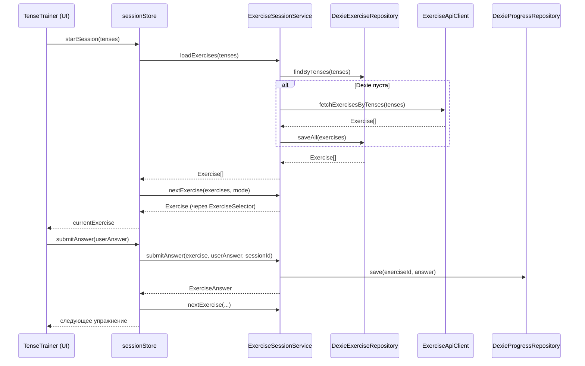
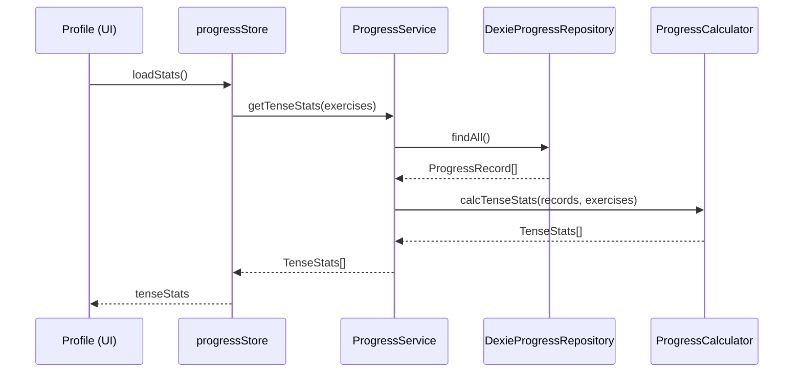

# Architecture Design — Tense Master

## Принципы

- **Domain** — ядро приложения, не знает ни про сервер ни про клиент
- **Server** — серверные адаптеры (Prisma, HTTP)
- **Client** — клиентские адаптеры (Dexie, API-клиент, Zustand)
- **Presentation** — только React UI, не содержит бизнес-логики
- **Shared** — только утилиты без бизнес-смысла (cn(), constants)
- Зависимости только внутрь: `presentation → client → domain ← server`

---

## Итоговая структура папок

```
domain/
  entities/
    Exercise.ts
    Answer.ts
  value-objects/
    Tense.ts
  repositories/
    IExerciseRepository.ts
    IProgressRepository.ts
    ISettingsRepository.ts
  services/
    AnswerValidator.ts
    ExerciseSelector.ts
    ProgressCalculator.ts

server/
  application/
    exercise/
      ExerciseService.ts
      dto/
        CreateExerciseDto.ts
        ExerciseResponseDto.ts
      index.ts
  infrastructure/
    http/
      ExerciseController.ts
      container.ts
    prisma-orm/
      PrismaExerciseRepository.ts
      prismaClient.ts
    seeds/
      seed.ts
      data/*.json

client/
  application/
    ExerciseSessionService.ts
    ProgressService.ts
    SettingsService.ts
    SyncService.ts               ← stub, реализуется позже
  stores/
    sessionStore.ts              ← текущая тренировка
    progressStore.ts             ← статистика и история
    settingsStore.ts             ← настройки пользователя
  infrastructure/
    dexie/
      schema.ts                  ← определение БД и таблиц
      client.ts                  ← singleton Dexie instance
      DexieExerciseRepository.ts
      DexieProgressRepository.ts
      DexieSettingsRepository.ts
    api/
      ExerciseApiClient.ts       ← GET /api/excersises

presentation/
  web/
    pages/
      Home/
      TenseTrainer/
      Profile/
      Settings/
    components/
      Header/
      InstallBanner/
      NetworkBadge/
  telegram/
  components/
    ui/                          ← shadcn компоненты

app/                             ← только Next.js routing
shared/
  lib/
    utils.ts                     ← cn() и прочие утилиты
  config/
    constants.ts
  hooks/
    useInstallPrompt.ts
    useNetworkStatus.ts
  pwa/
    serwist.ts
    sw.ts

prisma/
  schema.prisma
  migrations/
  generated/prisma/
```

---

## Domain layer

Никаких внешних зависимостей. Только TypeScript.

### Entities

**`domain/entities/Exercise.ts`**

```ts
export type Exercise = {
	id: string;
	question: string;
	answer: string;
	explanation: string;
	tense: Tense;
};
```

**`domain/entities/Answer.ts`**

```ts
// Уже существует — перенести из server/domain/entities/
export type ExerciseAnswerManual = {
	answer: string;
	skipped: false;
	isCorrect: boolean;
	createdAt: string;
	sessionId: string;
};

export type ExerciseAnswerSkipped = {
	answer: string;
	skipped: true;
	createdAt: string;
	sessionId: string;
};

export type ExerciseAnswer = ExerciseAnswerManual | ExerciseAnswerSkipped;
```

### Value Objects

**`domain/value-objects/Tense.ts`**

```ts
// Уже существует — перенести из server/domain/value-objects/
export const Tense = { ... } as const
export type Tense = typeof Tense[keyof typeof Tense]
```

### Repository Interfaces

**`domain/repositories/IExerciseRepository.ts`**

```ts
// Уже существует — перенести из server/domain/repositories/
export interface IExerciseRepository {
	findByTenses(tenses: Tense[]): Promise<Exercise[]>;
	findById(id: Exercise['id']): Promise<Exercise | null>;
}
```

**`domain/repositories/IProgressRepository.ts`** ← новый

```ts
export interface IProgressRepository {
	save(exerciseId: Exercise['id'], answer: ExerciseAnswer): Promise<void>;
	findByExerciseId(exerciseId: Exercise['id']): Promise<ExerciseAnswer[]>;
	findAll(): Promise<{ exerciseId: string; answer: ExerciseAnswer }[]>;
	clear(): Promise<void>;
}
```

**`domain/repositories/ISettingsRepository.ts`** ← новый

```ts
export interface ISettingsRepository {
	get(): Promise<UserSettings>;
	save(settings: UserSettings): Promise<void>;
}

export type UserSettings = {
	selectedTenses: Tense[];
	mode: 'random' | 'weighted'; // weighted = чаще показывать ошибки
	updatedAt: string;
};
```

### Domain Services

**`domain/services/AnswerValidator.ts`**
Чистая функция. Переезжает из `shared/lib/validateAnswer.ts`.

```ts
export function validateAnswer(userAnswer: string, correctAnswer: string): boolean;
```

**`domain/services/ExerciseSelector.ts`**
Логика выбора следующего упражнения из списка.

```ts
// random — равномерно случайный
export function selectRandom(exercises: Exercise[]): Exercise;

// weighted — упражнения с большим % ошибок показываются чаще
export function selectWeighted(exercises: Exercise[], stats: ExerciseStats[]): Exercise;
```

**`domain/services/ProgressCalculator.ts`**
Подсчёт статистики из истории ответов. Вход — массив ответов, выход — чистые данные без IO.

```ts
export type ExerciseStats = {
	exerciseId: string;
	total: number;
	correct: number;
	skipped: number;
	accuracy: number; // 0–1
};

export type TenseStats = {
	tense: Tense;
	total: number;
	correct: number;
	accuracy: number;
};

export type SessionStats = {
	sessionId: string;
	total: number;
	correct: number;
	skipped: number;
	accuracy: number;
};

export function calcExerciseStats(answers: ProgressRecord[]): ExerciseStats[];
export function calcTenseStats(answers: ProgressRecord[], exercises: Exercise[]): TenseStats[];
export function calcSessionStats(answers: ProgressRecord[]): SessionStats[];
```

---

## Client layer

### Dexie Schema

**`client/infrastructure/dexie/schema.ts`**

```ts
import Dexie, { type EntityTable } from 'dexie';

export type LocalExercise = Exercise & {
	syncedAt: string; // когда получено с сервера
};

export type ProgressRecord = {
	id: string; // uuid
	exerciseId: string;
	answer: ExerciseAnswer;
	createdAt: string;
	syncedAt: string | null; // null = не синхронизировано
};

export type LocalSettings = UserSettings & {
	anonymousId: string; // идентификатор устройства
	syncedAt: string | null;
};

export type SyncMeta = {
	key: string; // 'exercises' | 'progress' | 'settings'
	lastPulledAt: string | null;
	lastPushedAt: string | null;
};

export class TenseMasterDB extends Dexie {
	exercises!: EntityTable<LocalExercise, 'id'>;
	progress!: EntityTable<ProgressRecord, 'id'>;
	settings!: EntityTable<LocalSettings, 'anonymousId'>;
	syncMeta!: EntityTable<SyncMeta, 'key'>;

	constructor() {
		super('TenseMasterDB');
		this.version(1).stores({
			exercises: 'id, tense, syncedAt',
			progress: 'id, exerciseId, createdAt, syncedAt',
			settings: 'anonymousId',
			syncMeta: 'key',
		});
	}
}
```

**`client/infrastructure/dexie/client.ts`**

```ts
// Singleton — один экземпляр на всё приложение
export const db = new TenseMasterDB();
```

### Dexie Repositories

**`client/infrastructure/dexie/DexieExerciseRepository.ts`**
Реализует `IExerciseRepository`. Читает из локальной Dexie.

**`client/infrastructure/dexie/DexieProgressRepository.ts`**
Реализует `IProgressRepository`. Сохраняет каждый ответ с `syncedAt: null`.

**`client/infrastructure/dexie/DexieSettingsRepository.ts`**
Реализует `ISettingsRepository`. Хранит настройки + `anonymousId`.
При первом запуске генерирует `anonymousId` (uuid).

### API Client

**`client/infrastructure/api/ExerciseApiClient.ts`**
Единственная точка общения с сервером сейчас.

```ts
export async function fetchExercisesByTenses(tenses: Tense[]): Promise<Exercise[]>;
```

### Application Services

**`client/application/ExerciseSessionService.ts`**
Координирует тренировочную сессию. Использует репозитории и domain services.

```ts
// Загружает упражнения (сначала из Dexie, если пусто — с сервера)
loadExercises(tenses: Tense[]): Promise<Exercise[]>

// Выбирает следующее упражнение (random или weighted)
nextExercise(exercises: Exercise[], mode: Settings['mode']): Exercise

// Проверяет ответ и сохраняет в IProgressRepository
submitAnswer(exercise: Exercise, userAnswer: string, sessionId: string): Promise<ExerciseAnswer>

// Пропускает упражнение
skipExercise(exercise: Exercise, sessionId: string): Promise<ExerciseAnswer>
```

**`client/application/ProgressService.ts`**
Читает историю и считает статистику через ProgressCalculator.

```ts
getExerciseStats(): Promise<ExerciseStats[]>
getTenseStats(exercises: Exercise[]): Promise<TenseStats[]>
getRecentSessions(limit: number): Promise<SessionStats[]>
```

**`client/application/SettingsService.ts`**
Обёртка над ISettingsRepository с инициализацией дефолтов.

```ts
getSettings(): Promise<UserSettings>
updateSettings(patch: Partial<UserSettings>): Promise<void>
```

**`client/application/SyncService.ts`** ← stub

```ts
// Пока не реализован. Интерфейс зафиксирован, реализация позже.
pullExercises(): Promise<void>   // server → Dexie
pushProgress(): Promise<void>   // Dexie → server (только не syncedAt записи)
```

### Zustand Stores

Stores — клей между UI и application services. Хранят runtime-состояние сессии.

**`client/stores/sessionStore.ts`**

```ts
type SessionStore = {
	// состояние
	sessionId: string;
	exercises: Exercise[];
	currentExercise: Exercise | null;
	answers: ExerciseAnswer[];
	isLoading: boolean;

	// действия
	startSession(tenses: Tense[]): Promise<void>;
	submitAnswer(userAnswer: string): Promise<void>;
	skipExercise(): Promise<void>;
	nextExercise(): void;
	endSession(): void;
};
```

**`client/stores/progressStore.ts`**

```ts
type ProgressStore = {
	exerciseStats: ExerciseStats[];
	tenseStats: TenseStats[];
	recentSessions: SessionStats[];
	isLoading: boolean;

	loadStats(): Promise<void>;
};
```

**`client/stores/settingsStore.ts`**

```ts
type SettingsStore = {
	settings: UserSettings | null;
	isLoading: boolean;

	loadSettings(): Promise<void>;
	updateSettings(patch: Partial<UserSettings>): Promise<void>;
};
```

---

## Server layer (без изменений кроме путей)

После переноса `domain/` из `server/` в корень — `server/` содержит только адаптеры:

- `server/application/` — ExerciseService, DTOs (без изменений)
- `server/infrastructure/` — Prisma, HTTP (без изменений)
- `PrismaExerciseRepository` реализует `IExerciseRepository` из корневого `domain/`

---

## Потоки данных

### Тренировочная сессия



### Страница статистики



---

## Будущий Auth + Sync (архитектурные точки расширения)

Эти места специально оставлены под расширение — остальной код не меняется.

### Auth

- `client/infrastructure/api/AuthApiClient.ts` — login/register/refresh
- `DexieSettingsRepository` уже хранит `anonymousId` — при логине он связывается с аккаунтом

### Sync

- `client/application/SyncService.ts` — уже stub, реализуется:
  - `pullExercises()` — GET /api/exercises → Dexie, обновляет `syncedAt`
  - `pushProgress()` — берёт записи где `syncedAt = null`, POST на сервер, ставит `syncedAt`
  - `pushSettings()` — аналогично
- `SyncMeta` таблица в Dexie хранит `lastPulledAt` чтобы делать incremental sync
- Конфликты: упражнения — сервер выигрывает, прогресс — append-only (нет конфликтов), настройки — last-write-wins по `updatedAt`

---

## Миграция из текущего состояния

Порядок изменений без поломки работающего кода:

1. Перенести `server/domain/` → `domain/` (обновить импорты)
2. Перенести `Answer.ts` из `server/domain/entities/` → `domain/entities/`
3. Перенести `validateAnswer` из `shared/lib/` → `domain/services/AnswerValidator.ts`
4. Добавить `IProgressRepository`, `ISettingsRepository` в `domain/repositories/`
5. Создать `client/infrastructure/dexie/` — schema, client, repositories
6. Создать `client/application/` — services
7. Создать `client/stores/` — Zustand stores
8. Подключить stores в существующие компоненты (заменить прямые localStorage вызовы)
